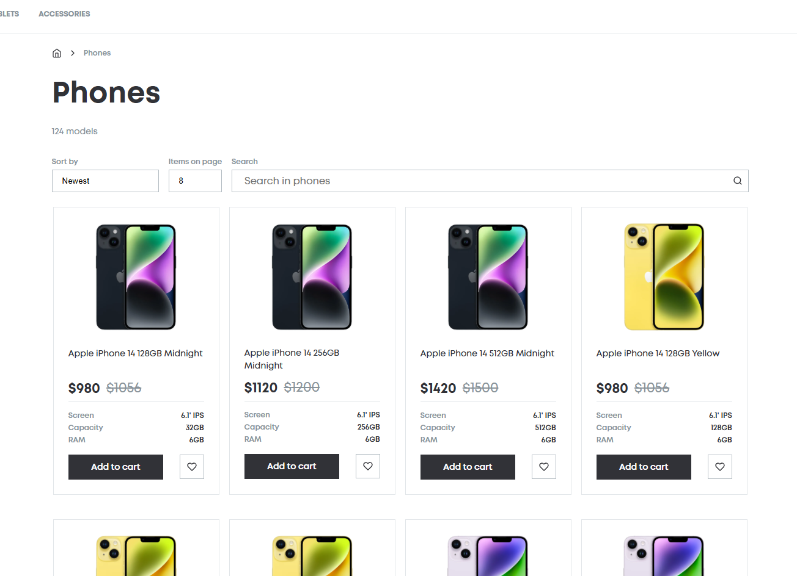

# Phone Catalog

## Description

The React Phone Catalog is a responsive web application showcasing a catalog of phones. Users can browse, search, filter, and sort phones by various criteria. The project demonstrates dynamic data handling, user-friendly navigation, and modern UI/UX practices built with React and Vite.

## Technologies that have been used

- HTML5
- CSS3
- SCSS
- JAVASCRIPT (ES6+)
- TYPESCRIPT
- REACT
- REST API
- GIT
- VITE
- REDUX-TOOLKIT

## Instructions for working with the project

1. Cloning a repository. You need to write `git clone https://github.com/boikoua/phone_catalog` in terminal.

2. Go to the project folder `cd phone_catalog`.

3. Check the node version. The version of node should be `v20.x.x`. To do this, type the command `node -v` in the terminal.

4. Install dependencies. To do this, enter the `npm install` command.

5. Run the project. To do this, enter the `npm start` command.
   After that the project will be available to you at `http://localhost:3000`.

## View project

> Link to the project
> [DEMO LINK](https://boikoua.github.io/phone_catalog/).

> Link to website layout in Figma
> [Phone Catalog](<https://www.figma.com/design/T5ttF21UnT6RRmCQQaZc6L/Phone-catalog-(V2)-Original?node-id=0-1&node-type=canvas&t=6Np2FEi7O4oPXy2O-0>)

## Preview

